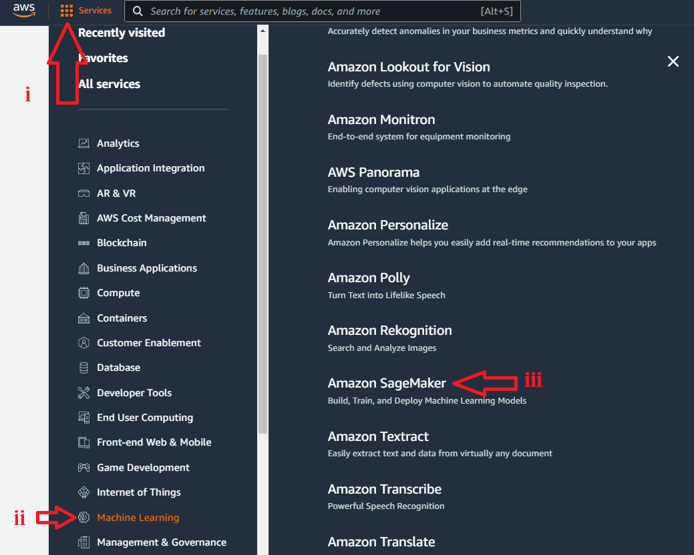
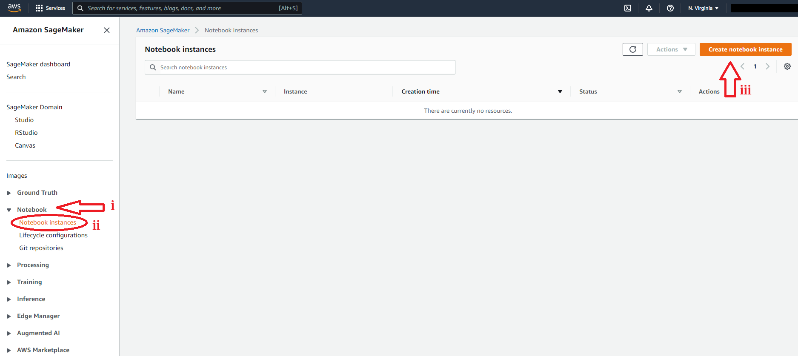
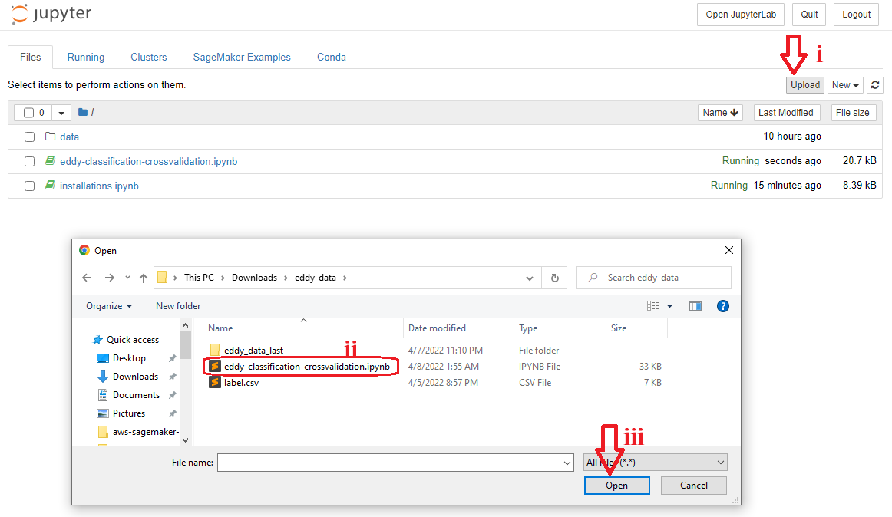
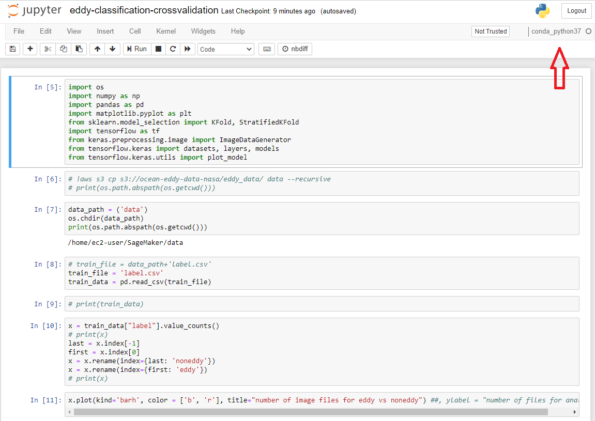
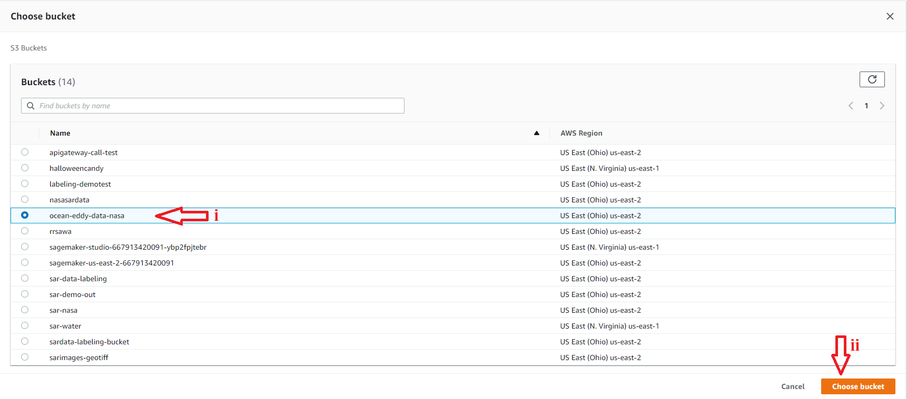
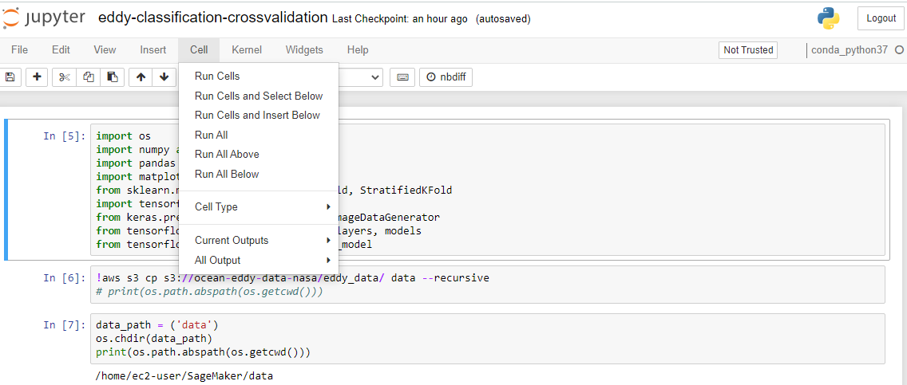
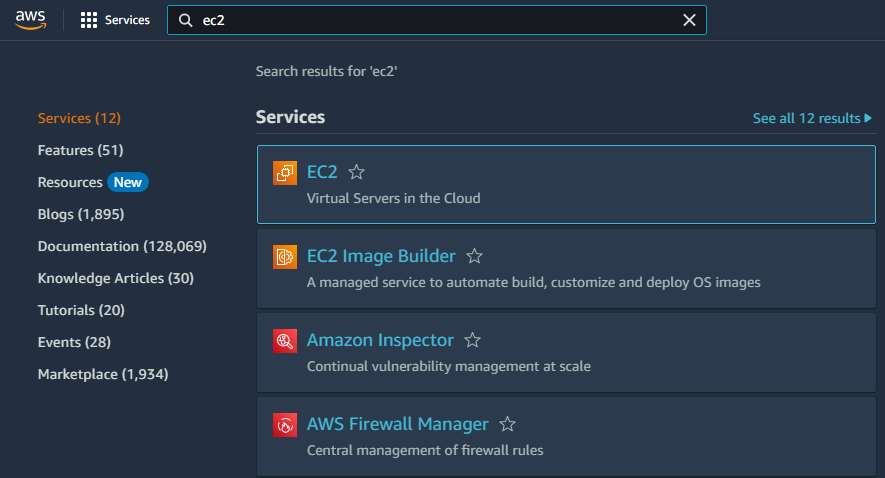
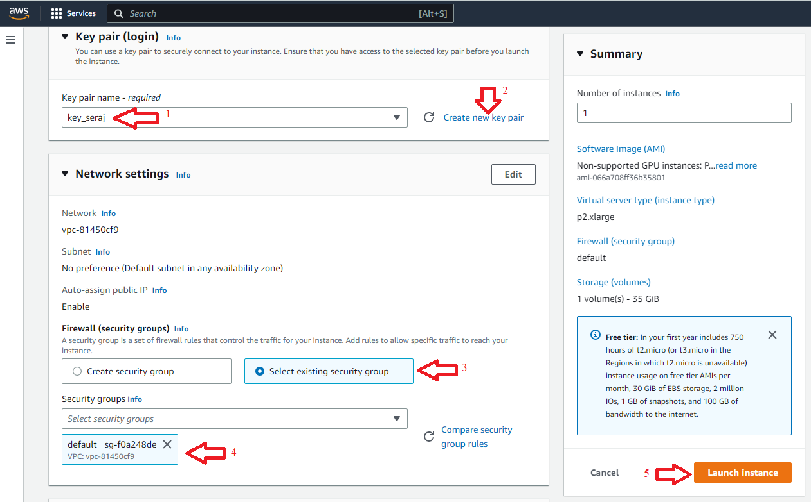
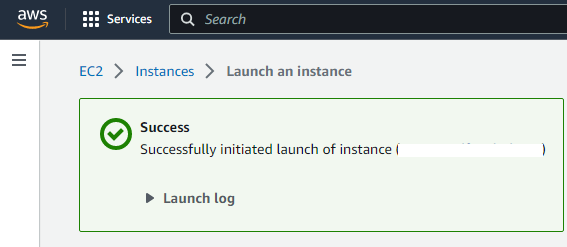

# Table of Contents
 >> ### 1. [What is Ocean Eddy?](https://github.com/big-data-lab-umbc/aws-automation/tree/main/gpu-example/OceanEddy#:~:text=README.md-,What%20is%20Ocean%20Eddy%3F,-The%20term%20eddy)
 >> ### 2. [SageMaker based Configuration](https://github.com/big-data-lab-umbc/aws-automation/tree/main/gpu-example/OceanEddy#:~:text=Configuring%20SageMaker%20for%20Ocean%20Eddy%20classification%20model)
 >> ### 3. [EC2 SageMaker based Configuration](https://github.com/big-data-lab-umbc/aws-automation/tree/main/gpu-example/OceanEddy#3-configuring-ec2-for-ocean-eddy-classification-model:~:text=3.%20Configuring%20EC2%20for%20Ocean%20Eddy%20classification%20model)


## 1. What is Ocean Eddy?
The term eddy refers to a circular current of water or air that appears to be an anomaly of the large-scale background flow. Coherent eddies in the ocean are temporary loops of swirling water that can travel long distances before dissipating. The size of ocean eddies cover a broad range between several kilometers to hundreds of kilometers.

## What is this repository about?
In this repository, we show how the small-scale eddies can be detected using CNN based models in the cloud platform from the SAR images. We used SageMaker and EC2 as the main platforms to deploy the models. Following is an example on how to configure the SageMaker for deploying ocean eddy detection mode.

## 2. Configuring SageMaker for Ocean Eddy classification model

SageMaker is an aws Service that allows you to use Jupyter like notebooks.

## Installation

Please follow the step-by-step instruction to configure SageMaker

### Step1 ***-Sigining in!-***

First, go to **www.aws.amazon.com** then click **sign in** to the console (on top right corner). Use your credentials (username, password, etc.) to login to the aws console.

### Step2 ***-Select Region-***

Once you are logged in, you should select the right **Region** (on top right corner) to make sure you are using all other related services or your team are in the same region. If this is a new account, default region is okay but next services onwards should be in the same region.


### Step3 ***-Getting into SageMaker console!-***

Now, you can click the **Services** _(with 9 dots)_ and choose **Machine Learning** from the dropdown. Then, click on the **Amazaon SageMaker** on the right side of the window to enter into the SageMaker page. Alternatively, you can type **sagemaker** in the search box _(second image)_, and you can click on the **Amazon SageMaker**. It will do the same.




### Step4 ***-Initiate a notebook!-***

Great! you are in SageMaker console. To get a notebook started, click on the **Notebook** in the left panel and you will see **Notebook instances**. Then, on the top right corner you need to click on the orange button saying **Create notebook instance**.



### Step5 ***-Configuring your notebook!-***

In this part, you have to do 3 things. At first _i)_ give a notebook instance name _(please note: this name has to be unique in the selected region, otherwise it will through errors)_. The next is you have to select a _(ii)_ Notebook instance type, that allows you to select the type of instance of your choice. Finally, an _(iii)_ IAM role should be selected or created. 

***Please note:*** you can create a new IAM role _(described in the next step)_ or your can select a predefined role _(if you already have one)_.


#### _Note related to Step5_

If you want to choose from a predefind role, make sure it is attached to the _Policy_ called **AmazonSageMakerFullAccess** and **AmazonS3FullAccess**. Creating a new IAM role automatically adds the policy **AmazonSageMakerFullAccess** by default.


### Step6 ***-Create an IAM role to access SageMaker with S3-***

**If you are creating a new IAM role, follow this step6, otherwise skip and go to next step**.

At this point you should go with the default one, which is _(ii)_ Any S3 bucket. It is good as it allows to access any S3 bucket. Next, you can click on the **Create role** button which will create an IAM Role and attach to Policy to SageMaker.


### Step7 ***-Start your notebook!-***

Now you are in the SageMaker and you already have your notebook/s listed. If it is not running, choose the one you want to run and click start. Remember, it may take 10 to 20 minutes to get running based on your instance type! Once it is ready to run, you will see **Open Jupyter | Open JupyterLab**. You can click either of those.


### Step8 ***-Working with notebook!-***

When you click **Open Jupyter** you will see the following window, click upload to upload the notebook you want to work with. The successfully uploaded notebook will appear under the Files _(next image)_. Now you can click on the uploaded notebook _(i.e., eddy_classidfication_crossvalidation.ipynb)_.




### Step9 ***-Choose the right Kernel!-***

When the notebook opens, you will see the contents of it. Here, you need to select the runtime environment (kernel) from the top right corner. In this case I selected the conda_python37 which I needed.



### Step10 ***-Create a S3 bucket!-***

In this step, we need to go back to **aws Services** to launch **S3**. Please follow the steps _(as, i, ii, and iii)_ to go to **S3**. once you clicked **S3**, you will be in **S3** console where you can create bucket or choose bucket by clicking the **Create bucket** button _(second image)_.


### Step11  ***-Configure your bucket!-***

If you want to create bucket, enter a _(i)_ **Bucket name** and click Create bucket or _(ii)_ Choose bucket, if you already have one. If you click to Choose a bucket you will be redirected to Choose bucket page _(second image)_ where can select the bucket and click **Choose bucket**. 




### Step12 ***-Communicate with S3 bucket from SageMaker!-***

Once the bucket creation/selection is done, we are back to SageMaker notebook to access the bucket. To do so we need to copy the data from S3 to SageMaker using `!aws s3 cp s3://your/s3/dir/ destDir --recursive` command. This command has four parts, `!aws s3 cp` is the copy command, `s3://your/s3/dir/` is the S3 URI _(example in second image on how to get the URI)_, `destDir` is the destination directiry in SageMaker where you want to store the data _(data is destination dir in our case as an example, ii)_, and `--recursive` is a flag to copy all file recursively from S3 bucket.


### Step13 ***-Run your code!-***

Fianlly, you can run the notebook. You can either run cell by cell using **cmd + return** or **shift + return** _(in mac)_, **ctrl + enter** or **shift + enter** _(in windows)_ OR Choose to ** Run All** from Run menu!



***Congratulations! You are all set with AWS SageMaker!***

## 3. Configuring EC2 for Ocean Eddy classification model

EC2 is an aws Service that allows you to deploy models in a comman line interface environment.

## Installation

Please follow the folliwing steps to configure EC2

### Step1 and Step2 ***-Sigining in! and Select Region-***

This two steps are the same as the previous one. Please follow accorddingly. Next steps are different. Please follow carefully!

### Step3 ***-Find EC2-***

click the **Services** _(with 9 dots)_ and choose **EC2** from the dropdown. Alternatively, you can type **ec2** in the search box _(second image)_, and you can click on it. 


### Step4 ***-Get the instance-***

Once you are in the EC2 console, click **Instances** under Instances on the left pannel.


### Step5 ***-launching an Instance-***

You will see an orange button on the top right corner as **Launch instances** _(as the following images shows)_ to start the launching process. 


### Step6 ***-Prepare the instance-***

First, You can give a **Name** _(though its optional, DemoTest is a name in this case)_, Second, choose an **OS** and third, select the **AMI** from the dropdown.


### Step7 ***-Choose the right AMI-***

In this section we chose a Deep learning Tensorflow based AMI as it comes with most of pre-installed libraries that we need. You can select any plain one _(i.e., ubuntu)_ and then install all necessary libraries


### Step8 ***-CPU or GPU-***

In this case we selected **P** type instance which is GPU. You can find on AWS which category is what _(in terms of CPU or GPU)_ and select the one you need.


### Step9 ***-Final Step-***

At this step, we need to select the key pair. If you already have one just select that _(1)_, or you can create a new one _(2)_. Next we need to select the security group. In this case we selected the existing _(3)_ default _(4)_ group. However, you can define your own security group as necessary which is not shown here. Rest of the setting can be left as it it. Finally we can clink the **Launch instance** button _(5)_ on the bottom right.



If the launch is success we will see something as follows.



Then we can go back to EC2 instances and see that the instance that we created is either running ot about to run. Next, we can click on the Instance ID to get the details of SSH.


The follwoing image shows on the top tab _(1)_ **SSH client**, if we select that we see the details. First we need to do the _(2)_ ```chmod``` on the key pair and then using _(3)_ the ssh comman on a terminal to access the EC2 console remotely. Here we can just write or import code and necessary files and simply run the code files which will generate resutls.


click the **Services** _(with 9 dots)_ and choose **EC2** from the dropdown. Alternatively, you can type **ec2** in the search box _(second image)_, and you can click on it.
