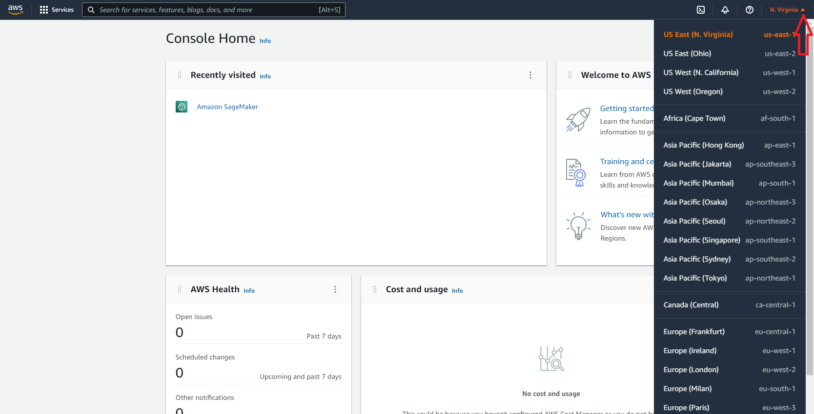
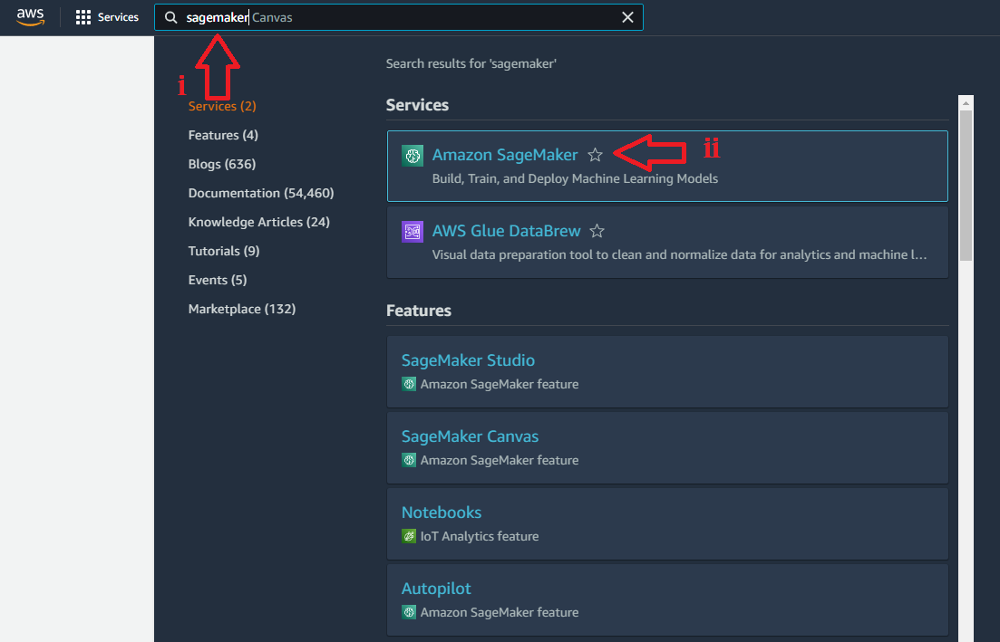
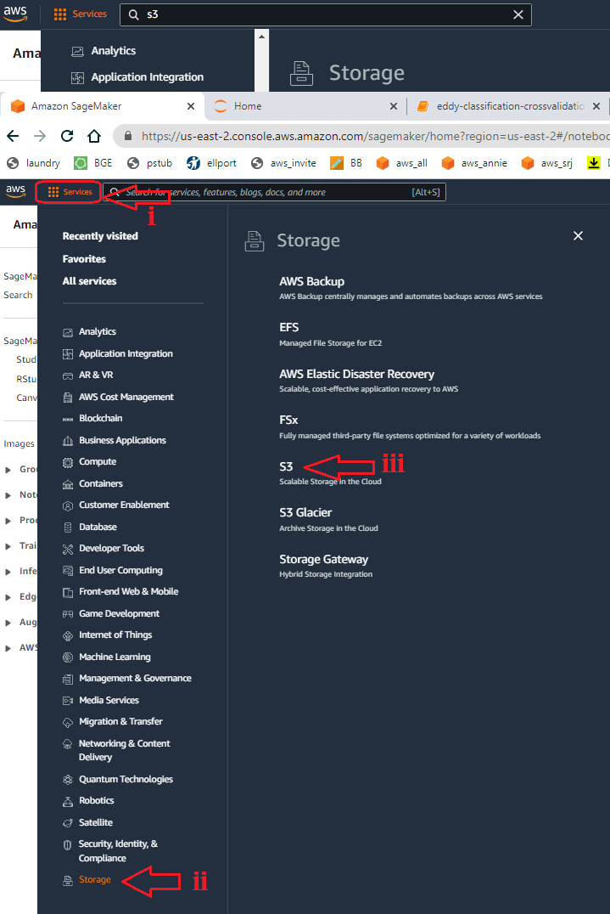
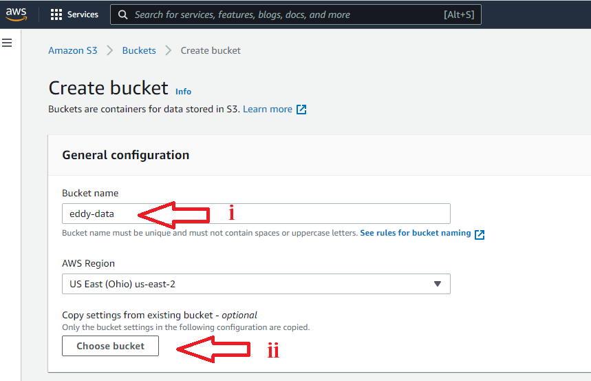

# Configure SageMaker

SageMaker is an aws Service that allows you to use notebooks (like jupyter notebooks).

## Installation

Please follow the step-by-step instruction to configure SageMaker

### Step1

First, go to **www.aws.amazon.com** then click **sign in** to the console (on top right corner). Use your credentials (username, password, etc.) to login to the aws console.

### Step2

Once you are logged in, you should select the right **Region** (on top right corner) to make sure you are using all other related services or your team are in the same region. If this is a new account, default region is okay but next services onwards should be in the same region.

### Step3

Now, you can click the **Services** _(with 9 dots)_ and choose **Machine Learning** from the dropdown. Then, click on the **Amazaon SageMaker** on the right side of the window to enter into the SageMaker page. Alternatively, you can type **sagemaker** in the search box _(second image)_, and you can click on the **Amazon SageMaker**. It will do the same.

### Step4

Great! you are in SageMaker console. To get a notebook started, click on the **Notebook** in the left panel and you will see **Notebook instances**. Then, on the top right corner you need to click on the orange button saying **Create notebook instance**.

### Step5

In this part, you have to do 3 things. At first _i)_ give a notebook instance name _(please note: this name has to be unique in the selected region, otherwise it will through errors)_. The next is you have to select a _(ii)_ Notebook instance type, that allows you to select the type of instance of your choice. Finally, an _(iii)_ IAM role should be selected or created. 

***Please note:*** you can create a new IAM role _(described in the next step)_ or your can select a predefined role _(if you already have one)_.

#### _Note related to Step5_

If you want to choose from a predefind role, make sure it is attached to the _Policy_ called **AmazonSageMakerFullAccess** and **AmazonS3FullAccess**. Creating a new IAM role automatically adds the policy **AmazonSageMakerFullAccess** by default.

### Step6

**If you are creating a new IAM role, followin this step, otherwise skip and go to next step**.

At this point you should go with the default one, which is _(ii)_ Any S3 bucket. It is good as it allows to access any S3 bucket. Next, you can click on the **Create role** button which will create an IAM Role and attach to Policy to SageMaker.

### Step7

Now you are in the SageMaker and you already have your notebook/s listed. If it is not running, choose the one you want to run and click start. Remember, it may take 10 to 20 minutes to get running based on your instance type! Once it is ready to run, you will see **Open Jupyter | Open JupyterLab**. You can click either of those.

### Step8

When you click **Open Jupyter** you will see the following window, click upload to upload the notebook you want to work with. The successfully uploaded notebook will appear under the Files _(next image)_. Now you can click on the uploaded notebook _(i.e., eddy_classidfication_crossvalidation.ipynb)_.

### Step9

When the notebook opens, you will see the contents of it. Here, you need to select the runtime environment (kernel) from the top right corner. In this case I selected the conda_python37 which I needed.

### Step10

In this step, we need to go back to **aws Services** to launch **S3**. Please follow the steps _(as, i, ii, and iii)_ to go to **S3**. once you clicked **S3**, you will be in **S3** console where you can create bucket or choose bucket by clicking the **Create bucket** button _(second image)_.

### Step11

If you want to create bucket, enter a _(i)_ **Bucket name** and click Create bucket or _(ii)_ Choose bucket, if you already have one. If you click to Choose a bucket you will be redirected to Choose bucket page _(second image)_ where can select the bucket and click **Choose bucket**. 

### Step12

Once the bucket creation/selection is done, we are back to SageMaker notebook to access the bucket. To do so we need to copy the data from S3 to SageMaker using `!aws s3 cp s3://your/s3/dir/ destDir --recursive` command. This command has four parts, `!aws s3 cp` is the copy command, `s3://your/s3/dir/` is the S3 URI _(example in second image on how to get the URI)_, `destDir` is the destination directiry in SageMaker where you want to store the data _(data is destination dir in our case as an example, ii)_, and `--recursive` is a flag to copy all file recursively from S3 bucket.

### Step13

Fianlly, you can run the notebook. You can either run cell by cell using **cmd + return** or **shift + return** _(mac keyboard)_ OR **ctrl + enter** or **shift + enter** _(in Windows keyboard)_.

***Congratulations! You are all set!***
